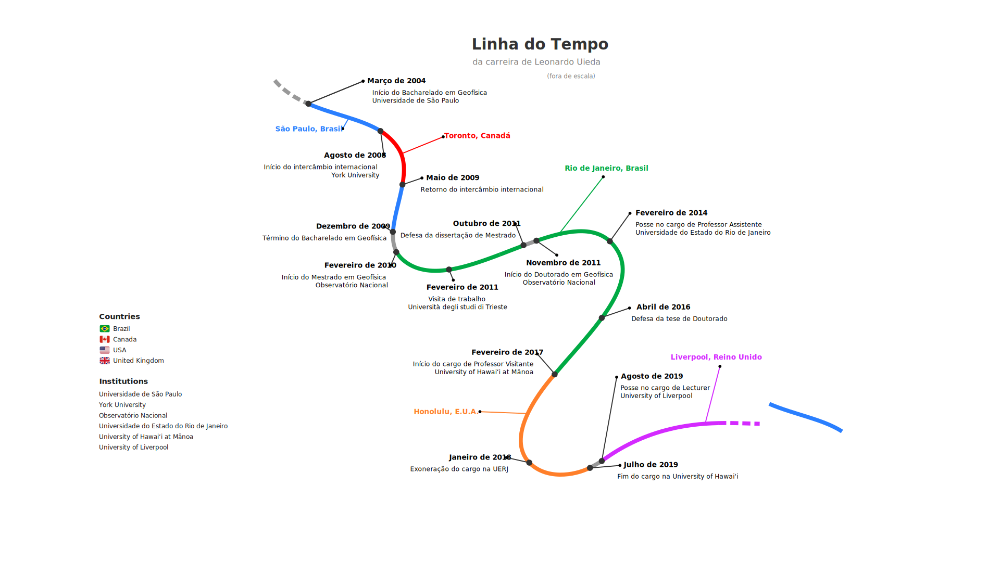

## Work

* Committed to **open practices** in teaching and research

<figure>

<figcaption>
Photo of me taken at the University of Liverpool's Central Teaching
Laboratories back in 2019.
</figcaption>
</figure>

### Need a photo?

If you need a photo of me for promotional material
(for talks or interviews, for example), use this one.

<figure>

<figcaption>
Photo of me taken at the University of Liverpool's Central Teaching
Laboratories back in 2019.
</figcaption>
</figure>

## Software

Here are some of the open-source source software develop:

* [**Fatiando a Terra**]({{ config.links.fatiando }}): Collection of Python
  libraries for Geophysics built by a community of geoscientists and software
  developers with a passion for well-designed tools and helping our peers. I've
  been working on Fatiando since around 2010 when I started my MSc. It's been
  the **main focus of my career** and it permeates all aspects of my work, from
  research to teaching.
* [**PyGMT**]({{ config.links.pygmt }}): The [Generic Mapping Tools]({{
  config.links.gmt }}) (GMT) is one of the most **widely used open-source
  projects in the Earth Sciences**. I had the pleasure to [join the GMT
  team](/blog/hawaii-gmt-postdoc.html) as a postdoc to create
  PyGMT. Lately, my contributions to GMT and PyGMT have been more on the
  community and guidance side. Thankfully, they don't really need me for the
  coding parts anymore.
* [**Tesseroids**]({{ config.links.tesseroids }}): Command-line programs for
  modelling the gravitational attraction of spherical prisms (tesseroids). This
  was my **first open-source project**, which I started during my BSc
  dissertation project with [Naomi
  Ussami](http://lattes.cnpq.br/6704246490515612) and [Carla
  Braitenberg](https://www2.units.it/braitenberg/). Through Tesseroids, I
  learned about documentation, unit tests, cross-compilation, version control,
  and more.
* [**Nēnē**]({{ config.links.nene }}): A no-frills static site generator. It's
  the side project that I use to blow off steam and experiment with new Python
  features. It's also what I **use to build this website**. The name is a nod
  to the [unforgettable time I spent in Hawai'i](/blog/hawaii-gmt-postdoc.html)
  and [Urubu](https://github.com/jandecaluwe/urubu), which I used to build my
  website before.
* [**xlandsat**](https://www.compgeolab.org/xlandsat): A Python library for
  loading Landsat multi-spectral remote sensing data downloaded from [USGS
  EarthExplorer](https://earthexplorer.usgs.gov/). It started as code I wrote
  for my [remote sensing class at
  Liverpool](https://github.com/leouieda/remote-sensing). It's also what I used
  to make some [pretty images of the 2022 Mauna Loa volcano
  eruption](../blog/mauna-loa.html) and [some nice
  wallpapers](https://github.com/leouieda/landsat-wallpapers).

## Non-work interests

Here are some things I enjoy in my limited free time:

* Cooking for my family and friends
* Reading and watching sci-fi and [fantasy][cosmere]
* Playing Incineroar in [Super Smash Bros Ultimate][smash]
* Failing to finish [Tears of the Kingdom][zelda]
* Baking sourdough [bread][bread] (my starter is from 2017 and has moved continents twice)
* Making noise with my ukulele and off-tune baritone
* Choir singing (I'm actually back in the same choir I sang in back in 2005-2007)

## Personal

I was raised in [Botucatu][botucatu], a small town about 200 km from São Paulo,
Brazil.
Since then, I've lived in: Ithaca (USA), São Paulo (Brazil), Toronto (Canada),
Rio de Janeiro (Brazil), Honolulu (Hawai'i/USA), and Liverpool (UK).
Currently, I'm back in São Paulo with my wife and daughter.

Both of my parents were zoology professors at
[UNESP](https://en.wikipedia.org/wiki/S%C3%A3o_Paulo_State_University), so I've
been around academia from an early age. A large benefit from this is that I got
to learn English in the USA during my parents postdoc at Cornell University. I
now realize what an incredible advantage this was for me and I'm eternally
grateful to my parents for the opportunity.

<figure>

<figcaption>
Me, my sister, and my mom looking at some invertebrate hiding under a rock in a creek in Ithaca, USA. Photo taken some time in 1997.
</figcaption>
</figure>

I was a bit of a nerdy kid. I had a Magic The Gathering phase and briefly had a
table-top RPG group. I liked playing video games, bike riding, and playing with
friends on the street.
As a teenager, I was the lead singer in an indie rock band called Jeca Tatu. We
weren't very good but we had loads of fun playing mostly covers at local
festivals and parties at our friends houses.

<figure>

<figcaption>
Jeca Tatu performing at a small festival put together by us and another local band some time in 2004.
</figcaption>
</figure>

I still enjoy playing games and music during my free time, only now I get to do
it with my daughter, which is quite an improvement!

[smash]: https://en.wikipedia.org/wiki/Super_Smash_Bros._Ultimate
[zelda]: https://en.wikipedia.org/wiki/The_Legend_of_Zelda%3A_Tears_of_the_Kingdom
[cosmere]: https://coppermind.net/
[bread]: https://github.com/leouieda/bread
[botucatu]: https://en.wikipedia.org/wiki/Botucatu
