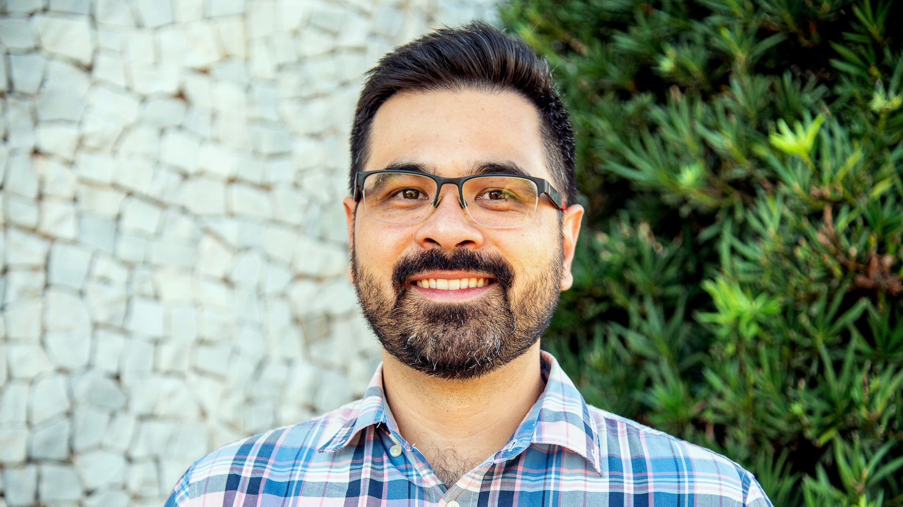
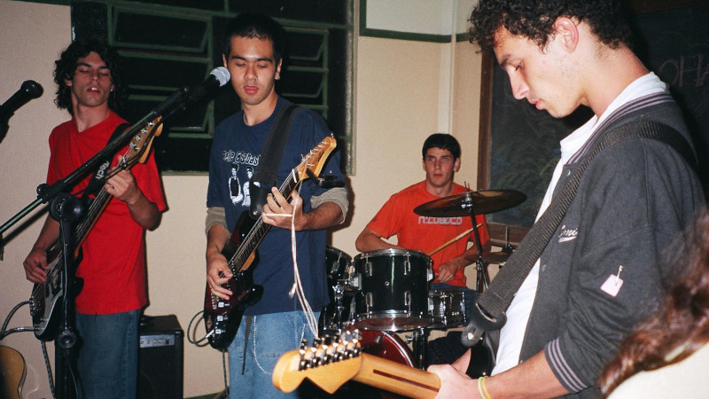

## Work

I have been working as **Professor of Geophysics** at [Universidade de São
Paulo]({{ config.links.iag }}) (USP), Brazil, since August 2023.
I use tiny disturbances in the Earth's gravity and magnetic fields to
investigate the inner structure of the Earth and it's evolution through time.
These disturbances can be measured on the ground using [specialized
equipment][gravimeter], onboard [dedicated satellites][grace], and even in very
small sections of rocks using [magnetic microscopes][qdm].
I also create new mathematical and computational methods for extracting as
much information as we can from these datasets.

<figure>

<figcaption>
Map of the thickness of the Earth's crust in South America derived from
satellite gravity data and seismological data. Yellow means thick crust of
60-70 km, green means moderate thickness of 25-50 km, and blue means thin crust
of 8-15 km. From <a href="https://doi.org/10.1093/gji/ggw390">Uieda & Barbosa
(2017)</a>.
</figcaption>
</figure>

In more technical terms, my main specialities are:

* Potential field methods (the study of the Earth's gravity and magnetic
  fields)
* Inverse problems (determining the Earth's inner structure from surface
  observations)
* Research software engineering (building quality software for science)

I started working on these topics in 2008 during a research internship under
Prof. [Naomi Ussami][naomi] during my time as an undergraduate student at USP,
and have continued throughout graduate school at the
[Observatório Nacional][on] with Prof. [Valéria C. F. Barbosa][valeria] and
a postdoc with Prof. [Paul Wessel][paul] at the
[University of Hawaiʻi at Mānoa][hawaii].

**Interested in my research or joining my lab?** See the
[Computer-Oriented Geoscience Lab]({{ config.links.compgeolab }}) website.

Most of my career has revolved around the development of open-source software
for geophysics, mainly [Fatiando a Terra]({{ config.links.fatiando }}) and
[PyGMT]({{ config.links.pygmt }}).
These software underpin and shape all of my research and teaching.
My approach to science in general is also heavily influenced by the **open
source** and **open science** movements.
All of the papers, code, figures, slides, and teaching resources I create are
freely available under permissive **open licences**, like [CC-BY][cc-by] and
[BSD][bsd].

<figure>

<figcaption>
Photo of me during my first seminar as a new Lecturer at the University of
Liverpool, sometime in late 2019.
</figcaption>
</figure>

Before my current position at USP, I was a **Lecturer in Geophysics** at the
[University of Liverpool][liverpool], UK, **Visiting Researcher** at the
[University of Hawaiʻi at Mānoa][hawaii], USA, and **Professor of Geophysics**
at the [Universidade do Estado do Rio de Janeiro][uerj], Brazil.
I am and have been involved with several community-led organizations, like the
[Software Underground]({{ config.links.swung }}) and [EarthArXiv][eartharxiv].

### Need a photo?

If you need a photo of me for promotional material
(for talks or interviews, for example), use this one.
Feel free to crop it however you see fit.

<figure>

<figcaption>

Photo of me taken at the University of Liverpool's Central Teaching
Laboratories back in 2019. You may use this photo under the terms of the
[CC-BY][cc-by] license.

</figcaption>
</figure>

## Software

Here are some of the open-source software develop:

* [**Fatiando a Terra**]({{ config.links.fatiando }}): Collection of Python
  libraries for Geophysics built by a community of geoscientists and software
  developers with a passion for well-designed tools and helping our peers. I've
  been working on Fatiando since around 2010 when I started my MSc. It's been
  the **main focus of my career** and it permeates all aspects of my work, from
  research to teaching.
* [**PyGMT**]({{ config.links.pygmt }}): The [Generic Mapping Tools]({{
  config.links.gmt }}) (GMT) is one of the most **widely used open-source
  projects in the Earth Sciences**. I had the pleasure to [join the GMT
  team](/blog/hawaii-gmt-postdoc.html) as a postdoc to create
  PyGMT. Lately, my contributions to GMT and PyGMT have been more on the
  community and guidance side. Thankfully, they don't really need me for the
  coding parts anymore.
* [**Tesseroids**]({{ config.links.tesseroids }}): Command-line programs for
  modelling the gravitational attraction of spherical prisms (tesseroids). This
  was my **first open-source project**, which I started during my BSc
  dissertation project with [Naomi Ussami][naomi] and [Carla
  Braitenberg][carla]. Through Tesseroids, I learned about documentation, unit
  tests, cross-compilation, version control, and more.
* [**Nēnē**]({{ config.links.nene }}): A no-frills static site generator. It's
  the side project that I use to blow off steam and experiment with new Python
  features. It's also what I **use to build this website**. The name is a nod
  to the [unforgettable time I spent in Hawai'i](/blog/hawaii-gmt-postdoc.html)
  and [Urubu][urubu], which I used to build my website before.
* [**xlandsat**]({{ config.links.xlandsat }}): A Python library for
  loading Landsat multi-spectral remote sensing data downloaded from [USGS
  EarthExplorer](https://earthexplorer.usgs.gov/). It started as code I wrote
  for my [remote sensing class at
  Liverpool](https://github.com/leouieda/remote-sensing). It's also what I used
  to make some [pretty images of the 2022 Mauna Loa volcano
  eruption](../blog/mauna-loa.html) and [some nice
  wallpapers](https://github.com/leouieda/landsat-wallpapers).

## Non-work interests

Here are some things I enjoy in my limited free time:

* Cooking for my family and friends
* Reading and watching sci-fi and [fantasy][cosmere]
* Playing Incineroar in [Super Smash Bros Ultimate][smash]
* Failing to finish [Tears of the Kingdom][zelda]
* Baking sourdough [bread][bread] (my starter is from 2017 and has moved continents twice)
* Making noise with my ukulele and off-tune baritone
* Choir singing (I'm actually back in the same choir I sang in back in 2005-2007)

## Personal

I was raised in [Botucatu][botucatu], a small town about 200 km from São Paulo,
Brazil.
Since then, I've lived in: Ithaca (USA), São Paulo (Brazil), Toronto (Canada),
Rio de Janeiro (Brazil), Honolulu (Hawai'i/USA), and Liverpool (UK).
Currently, I'm back in São Paulo.

<figure>

<figcaption>
Satellite images of Rio de Janeiro (left), Honolulu (middle), and Liverpool
(right). Created using <a href="{{ config.links.xlandsat }}">xlandsat</a> and
public domain data from the Landsat 8 and 9 satellites.
</figcaption>
</figure>

My wife [Carol][paper] is a biologist and science writer. After quite a few
career shifts after her PhD, she now works with outreach and event organization
at the [Society for Experimental Biology][seb]. I'm very lucky that she puts up
with me and was willing to go half-way around the world with me throughout this
winding career path. We have a wonderful, smart, and strong-willed daughter. I
couldn't be prouder of both of them!

Both of my parents were zoology professors at
[UNESP](https://en.wikipedia.org/wiki/S%C3%A3o_Paulo_State_University), so I've
been around academia from an early age. A large benefit from this is that I got
to learn English in the USA during my parents postdoc at Cornell University. I
now realize what an incredible advantage this was for me and I'm eternally
grateful to my parents for the opportunity.

<figure>

<figcaption>
Me, my sister, and my mom looking at some invertebrate hiding under a rock in a creek in Ithaca, USA. Photo taken some time in 1997.
</figcaption>
</figure>

I was a bit of a nerdy kid. I had a Magic The Gathering phase and briefly had a
table-top RPG group. I liked playing video games, bike riding, and playing with
friends on the street.
As a teenager, I had a punk rock phase (yes, that included a mohawk) and I was
the lead singer in an indie rock band called Jeca Tatu. We weren't very good
but we had loads of fun playing mostly covers at local festivals and parties at
our friends houses.
I still enjoy playing games and music during my free time, only now I get to do
it with my daughter!

<figure>

<figcaption>
Jeca Tatu performing at a small festival put together by us and another local band some time in 2004.
</figcaption>
</figure>

[smash]: https://en.wikipedia.org/wiki/Super_Smash_Bros._Ultimate
[zelda]: https://en.wikipedia.org/wiki/The_Legend_of_Zelda%3A_Tears_of_the_Kingdom
[cosmere]: https://coppermind.net/
[bread]: https://github.com/leouieda/bread
[botucatu]: https://en.wikipedia.org/wiki/Botucatu
[naomi]: http://lattes.cnpq.br/6704246490515612
[carla]: https://www2.units.it/braitenberg/
[liverpool]: https://www.liverpool.ac.uk/earth-ocean-and-ecological-sciences/
[uerj]: https://www.uerj.br/
[hawaii]: https://www.soest.hawaii.edu/earthsciences/
[cc-by]: https://creativecommons.org/licenses/by/4.0/
[bsd]: https://opensource.org/license/BSD-3-clause
[eartharxiv]: https://eartharxiv.org/
[urubu]: https://github.com/jandecaluwe/urubu
[gravimeter]: https://en.wikipedia.org/wiki/Gravimetry#Gravimeters
[grace]: https://en.wikipedia.org/wiki/GRACE_and_GRACE-FO
[qdm]: https://qdm.io/
[paper]: https://www.acarolcolombo.com/
[seb]: https://www.sebiology.org/
[paul]: https://en.wikipedia.org/wiki/P%C3%A5l_Wessel
[on]: https://www.gov.br/observatorio/pt-br
[valeria]: https://www.pinga-lab.org/people/barbosa.html
