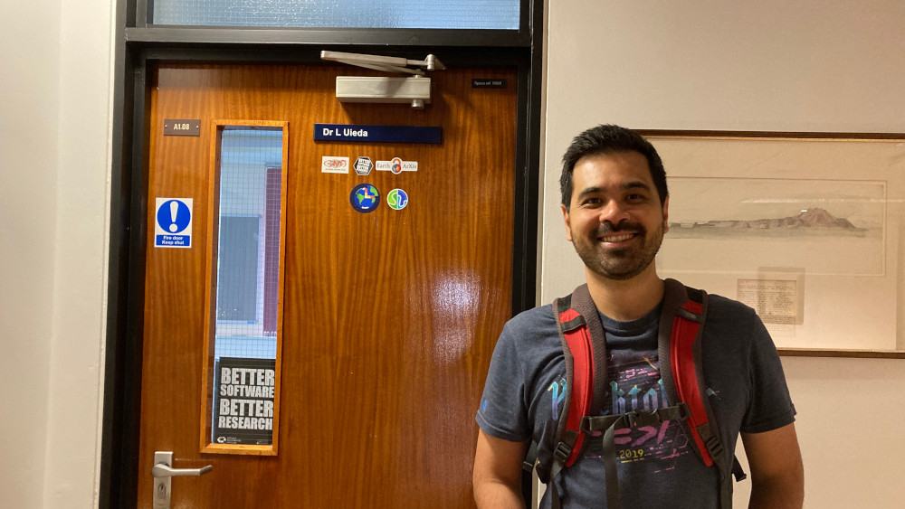
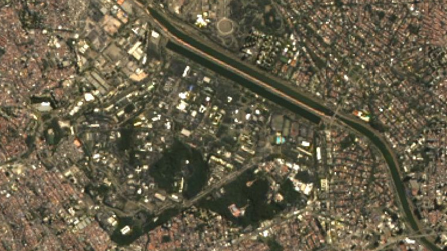

Today is my last day working at the University of Liverpool and my last week
living in the UK.
It's been a busy, interesting, exciting, and life-changing experience.
I'll always be glad that I came and immensely grateful to all of my colleagues
and friends for welcoming me and my family and making us feel at home.
But it's time for a change and I'm very happy to announce that **I'll be
starting a new job as Professor (Doutor) at the
[Universidade de São Paulo](https://www.iag.usp.br/) (USP), Brazil,
at the end of August!**

I've been in the UK for just under 4 years, during which we survived the
craziness of the COVID19 lockdowns and online teaching, had a kid, traveled,
made friends, and got to experience life as first-time parents far away from
close family.
It was an incredible experience and I learned so much about myself, the UK
academic system, and many different and fascinating parts of the geosciences
that I hadn't had contact with until now.
It's sad to leave wonderful friends and colleagues behind and I hope to be back
soon for a visit.

<figure>

<figcaption>
Saying goodbye to my University of Liverpool office.
Just when I had finished buying new furniture, nice 4k monitors, and a load of
plants to make it look nice...
Photo credit:
<a href="https://www.acarolcolombo.com/">Ana Caroline Colombo</a>.
</figcaption>
</figure>

The selection process for the position in São Paulo was very intense, as they
usually are in Brazil, with several phases, things to write, and lots to study.
On the plus side, it forced me to revisit some parts of potential-field theory
which I hadn't looked at since my time in grad school.
Looking back on that content now gave me a much deeper appreciation for some
topics and even some research ideas for the future.
I also had to write a narrative academic auto-biography (called a *memorial* in
Portuguese), which takes the place of a CV and is supposed to also include
reflections on one's career and achievements.
Mine ended up 60-pages long and was equal parts exhausting and inspiring to
write.
The process provided a clearer picture of where I've been heading with my
career, the things that I value most in an academic job, and from where some of
the roots of my way of doing science came.
If you'd like to read it (or use it as a template to write your own), it's
available on the GitHub repository
<i class="fab fa-github" aria-hidden="true"></i>
[`leouieda/memorial2023`](https://github.com/leouieda/memorial2023)
as both a PDF and the LaTeX source code (under a
[CC-BY license](http://creativecommons.org/licenses/by/4.0/)).

It's very exciting to return to the place where I started my journey in
Geophysics way back in 2004.
The Department still feels like home, even after almost 15 years away, and this
move will hopefully rekindle local collaborations and provide new work
opportunities.
I'm also looking forward to seeing how the Geophysics Bachelor's degree has
changed since my time as a student and what I can bring from my experience at
Liverpool to enrich the curriculum.

<figure>

<figcaption>
A pan-sharpened Landsat 9 scene of the USP campus. The campus is next to the
Pinheiros river and is an island of green amid the city of São Paulo.
I learned how to work with remote-sensing data like this in order to teach
the ENVS258 module at Liverpool.
Created with
<a href="https://www.compgeolab.org/xlandsat">xlandsat</a>
from scene 219/076 from 2022/09/02.
</figcaption>
</figure>

The [CompGeoLab](https://www.compgeolab.org/) will relocate to Brazil (in
spirit at least, since we don't really have physical space and kit in
Liverpool) but we already work virtually very well.
India will be staying at Liverpool to finish her PhD and we're looking forward
to hosting her in São Paulo for some time.
We'll also likely have some new students coming in from São Paulo in the near
future.
I'm looking forward to being able to have physical space to setup a computer
lab and perhaps take part in some of the potential-fields data acquisition work
for which the Department is known in Brazil.

Between now and 21 August, I'll be taking a bit of time off to rest, move
back across the Atlantic, and get settled in São Paulo.
So I may disappear for a bit but I'll be back (at least partially) recharged to
start this new chapter!
