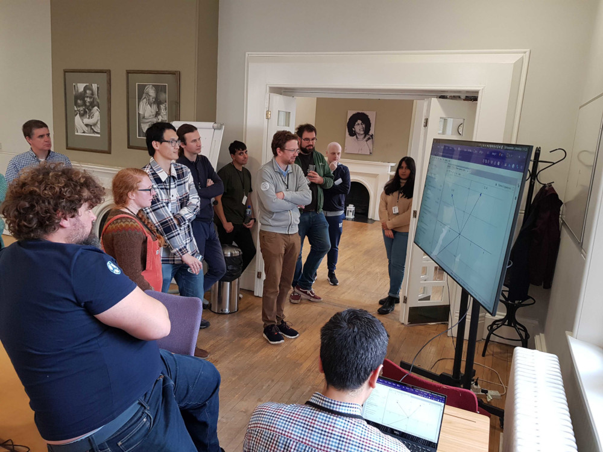

This blog post was first published on the
[Software Sustainability Institute's blog](https://www.software.ac.uk/blog/2023-05-29-geocode-uk-lessons-organizing-sprints-mixed-audience)
on 29 May 2023 under a
[CC-BY-NC license](https://creativecommons.org/licenses/by-nc/2.5/scotland/).
It's republished here under the same license.

After moving to the UK in 2019, I found myself missing some of the connections
I had made in my previous job with folks that live in the border between
geoscience and open research software. So I based my SSI Fellowship around
establishing new connections within the UK. Or at least that was the plan.
Reality ended up being 2 whole years away from in-person events because of the
COVID19 pandemic and very little time and energy to devote to socializing.

When 2022 rolled in with relaxations in social restrictions, I was thrilled to
finally be able to organize an event for myself and my fellow geo-coders.
That's how the "Geo+Code" event came to be. My main idea was to gather UK
geosciencists who code for a 1-day event in Liverpool. The format was inspired
by the "sprints" that happen after events like the [Scipy
Conference](https://www.scipy2022.scipy.org/), where everyone gathers to work
on coding projects for 1-2 days. The format is great to building relationships
and producing something concrete as an output.

This blog post reports on how the event went, some of the challenges we faced,
and some of the things that worked well.

## The event

After brainstorming some ideas, I came up with the following goals for the event:

* This would be a gathering of people in the intersection of geoscience,
  coding, education, and open source/data/science.
* The focus is on **doing** something together that can be the start of great
  collaborations going forward.
* We'll gather for 1 day, in-person, at a nice venue.
* Participants will have the chance to introduce themselves and pitch a project
  idea.
* All communication will be through the [Software
  Underground](https://softwareunderground.org/) Slack, an awesome open
  community. Having everyone there ensures that conversations can easily
  continue after the event.
* During the event, we'll pick one or more projects to work on together.
* The projects could be coding something, producing a video, joining teaching
  material, or anything generating **open resources**.

I put out a call for participants in the [Software
Underground](https://softwareunderground.org/) and got several responses. One
of the first was from 2023 SSI Fellow [Michael
Tso](https://software.ac.uk/about/fellows/michael-tso), who was instrumental in
getting the event organized and the venue sorted (thanks, Michael!). On 28
November 2022, 14 participants from 10 different institutions showed up to
[Blackburne House](https://www.blackburnehouse.co.uk/), Liverpool, for a day of
chatting, coding, and content creation.

<figure>

<figcaption>
Geo+Code participants watching a demo of open educational resources using
<a href="https://jupyterbook.org/en/stable/">JupyterBook</a>.
</figcaption>
</figure>

The event was a success, with good feedback from participants and a lot of happy
faces. Most participants didn't know each other previously or had only met
online. During the event, we settled on two projects that would be tackled:

1. Reviewing the tutorials and examples in the documentation of
   [SimPEG](https://simpeg.xyz/), an open-source geophysics software. This
   group had the objective to comb through the examples and identify any broken
   code or sections that required more detailed instructions in the software. A
   thing to note is that none of the participants is a core developer on
   SimPEG.
2. Developing an open textbook for applied geophysics that can be used to teach
   undergraduate courses. The book would be based on
   [JupyterBook](https://jupyterbook.org/en/stable/) and would include
   computational lessons and open data. The book would be hosted under the
   [Geophysics Library](https://github.com/GeophysicsLibrary) GitHub
   organization.

## Challenge: Organizing an inclusive event

From the started, I wanted to make sure that this event would be as inclusive
as possible and included participants from diverse backgrounds.
Unsurprisingly, putting out a call for volunteers did not produce a very
diverse set of attendants. So I explicitly invited people who would be a great
fit for the event but wouldn't necessarily put themselves forward as
participants, which was much more effective at attracting participants than
simply putting out an open call.

Since myself and other participants have young children, I tried to schedule
the event for a weekday and provide childcare support for those who would
require it. This proved to be a major difficulty. Local nurseries wouldn't
accept children for a one-time event and it was difficult to find a provider
who would be able to care for 1-5 children only for a single day. In the end,
none of the participants ended up needing the childcare and I have yet to find
a good solution for this.

## Challenge: Variable levels of technical skill

Our participants came with a range of technical backgrounds, some very
experienced with software engineering and others only familiar with the content
of [Software Carpentry](https://software-carpentry.org/) lessons. This meant
that a single day for working together on a shared GitHub repository was not
enough. We spent most of the day getting everyone up to speed on:

* Setting up a working development environment with `conda` and `git`.
* Forking and cloning a GitHub repository.
* Creating branches and pushing them to GitHub.
* Opening and merging pull requests.
* Building HTML from Jupyter Notebooks using JupyterBook.

Between this and brainstorming what we wanted to include in our book, we were
left with very little time for actually creating content for the book. By the
time we wrapped up, our book was little more than a test document with people's
names and a skeleton for the chapters.

Ideally, this should have been organized as a 2-day event, with training in day
1 and sprinting in day 2. However, making the event longer conflicts with the
inclusivity of it because it requires a higher commitment than some may be able
to make. In the future, I hope to experiement with a hybrid model where the
training is done online and async ahead of the in-person event.

## Outcomes

The outcomes of the day were:

1. Participants identified that the main source of frustration with the SimPEG
   examples was obtaining a working environment with the software installed. A
   considerable amount of time was spent on trying to get a working version of
   the software environment on everyone's computers. Afterwards, the examples
   themselves executed without any issues. This would be fed back to the SimPEG
   developers as something to focus on in the future.
2. The open applied geophysics book was started in
   https://github.com/GeophysicsLibrary/applied-geophysics. The scope and main
   direction for the book has been laid out already and hopefully a future
   event can be used to kickstart the content.

It was also great to meet so many new people, most of which I only knew
virtually (or not at all). Everyone seemed to come out of it excited and some
were event considering hosting a follow-up event at their institutions in the
future.

I hope this post can be helpful for those who want to organize similar events.
Of course, I'd be more than happy to get suggestions for how I could do things
better in the future. Drop me a message!
