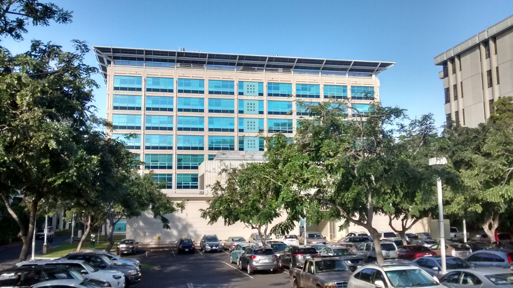

Back in July of 2016, I applied for a postdoc position to build Python bindings
for the [Generic Mapping Tools (GMT)](http://gmt.soest.hawaii.edu/) software
with Professor [Paul Wessel](http://www.soest.hawaii.edu/wessel/) at the
[University of Hawaii](http://www.soest.hawaii.edu/GG/index.html).
The short version is that I got the position, asked for a 1 year leave from
[UERJ](http://www.uerj.br/) (where I currently work as a professor),
came to Hawaii, and right now I'm starting to get familiar with the GMT code
base.

Read on for the long version.

<figure>

<figcaption>
The Pacific Ocean Science and Technology (POST) building in the UH Manoa
campus. My office is on the top floor with a nice view of downtown Honolulu.
</figcaption>
</figure>

After two and half years as a [Professor at UERJ](/about),
struggling to teach classes without any experience or time to prepare,
all while finishing my PhD,
I was feeling a bit burned-out and eager to do something different.
Meanwhile, Brazil was (and still is) in a huge economic and political crisis
and Rio was hit pretty hard.
The University, which is State owned, was on strike from March 2016 until after
the Olympic games in August.
The time was ripe to apply for something different abroad.

I signed up for a couple of mailing lists where people post job opportunities
just to see what was out there.
If you're looking for a new position or just want to get a feeling for what is
currently on demand, I highly recommend signing up for the
[Computational Infrastructure for Geodynamics (CIG) list](http://lists.geodynamics.org/cgi-bin/mailman/listinfo/cig-jobpostings)
and the
[Earth Sciences Job Email list (ES-JOBS)](http://mailman.ucar.edu/mailman/listinfo/es_jobs_net).
I get at least 5-10 emails on the ES-JOBS list per day (you might want to
redirect them to a folder to keep your inbox from exploding).
After about a month on the lists, this message from Paul came on the CIG list:

> A full-time postdoctoral position is available in the Department of Geology
> and Geophysics at the University of Hawaii at Mānoa to participate in funded
> research in support of the expansion of the Generic Mapping Tools (GMT) to
> Python (possibly via Cython), with applications in plate tectonics and
> geodynamics. A one-year initial appointment is anticipated, with the
> possibility of a second year extension, depending on progress and
> availability of funds.
>
> The successful applicant will be a highly motivated, independent researcher
> with extensive programming experience (preferably in C) and Python scripting
> and will assist Dr. Wessel and the GMT team in developing the GMT/Python API.
> Applicants must have completed a PhD in the physical sciences at the time of
> appointment, with a preference for geophysics, and should be proficient in
> spoken and written English. The position is open immediately and will remain
> open until an appointment is made.
>
> To apply, please send a curriculum vitae, a brief (1 page) statement of
> research objectives, a brief (1 page) statement of skills or experience
> suitable for contributing to GMT development, and the names of three
> references to Dr. Paul Wessel.  Questions should also be addressed to Dr.
> Wessel directly via e-mail. Information on the Department can be found at
> http://www.soest.hawaii.edu/GG. The University is an Equal
> Opportunity/Affirmative Action Institution.

The requirements seemed to fit me perfectly.
My [Bachelor's thesis](https://doi.org/10.6084/m9.figshare.963547) was to developed a
[C program](http://www.tesseroids.org) and I spent most of my PhD
building a [Python library](https://www.fatiando.org).
After some careful consideration with my wife and bit of hesitation, I decided
to apply for the position.
I consulted my department and they generously agreed to cover my
geophysics courses
during the year that I would be away.
So I sent in
[my CV](https://github.com/leouieda/cv/releases/download/June2016/leonardo_uieda_cv.pdf),
the [statement of research objectives](https://github.com/leouieda/cv/releases/download/June2016/leonardo_uieda_research_statement.pdf),
and the [statement of skills](https://github.com/leouieda/cv/releases/download/June2016/leonardo_uieda_skills_statement.pdf).
As always, the LaTeX sources for all three are on a
[GitHub repository](https://github.com/leouieda/cv/tree/June2016) if you want
to have a look or need a template to get started.

I did a Skype interview with the very friendly GMT team and after a while I got
an email saying that the position was mine!
I finished my responsibilities for 2016 and took some vacation time to
sort out the trip.
In the middle of February I hopped on a quick ~24h trip from São Paulo to
Honolulu and now here I am.

<figure>

<figcaption>

My new desk at UH with a great view of the tall buildings of
[Waikiki](https://en.wikipedia.org/wiki/Waikiki) and downtown Honolulu on a
nice rainy day.

</figcaption>
</figure>

The goal of the project is to build a bridge between GMT (a set C-coded
command-line programs) and the Python programming language.
GMT is arguably the best map plotting software around and
it certainly makes [the most beautiful maps](http://gmt.soest.hawaii.edu/doc/latest/Gallery.html).
This bridge will bring that power to the Python community.

The way I'm currently exploring for doing this is to hook into the
[GMT C API](http://gmt.soest.hawaii.edu/doc/latest/GMT_API.html) (the internal
functions that GMT exposes through a shared library)
using the [ctypes](https://docs.python.org/3/library/ctypes.html)
package from the Python standard library.
This way, a user could call the internal GMT functions from a Python program
or, even better, from a [Jupyter notebook](http://jupyter.org/).
This will serve as a basis for building a more Pythonic higher-level library
for GMT.
Hopefully this will help smooth the rough edges of the GMT command-line
interface that cuts newbies and gurus alike.
After all, who could possibly remember what [`-DjTR+o0.3i/0.1i+w4i/0.2i+h` is
supposed to
do](http://gmt.soest.hawaii.edu/doc/latest/gallery/ex17.html#example-17)?

Right now, I'm still struggling with CMake configuration issues, linking
problems, incompatibilities with
[Anaconda](https://www.continuum.io/downloads#all), and other pleasant things
that come with dealing with compiled code.
But I'll write more about that in a later post.
*Now, I wonder where I put that `libgdal.so` file?*
