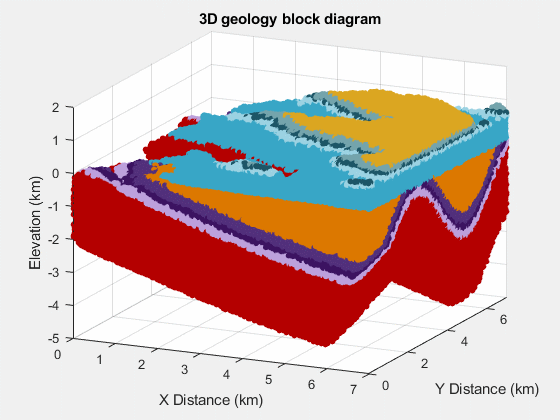

Before the second day of my 4-week "Introduction to Python for Geoscientists"
workshop a few weeks ago, I was asked by a student why they needed to learn how
to code.
After all, they are training to become a geologist, not a geophysicist, and
couldn't see how this would be useful in their future career.

It was a fair question since, by that point, all we had seen were variables and
basic data types and operations.
Day 2 of the workshop covers loading data
with numpy and making plots (following the excellent
[Software Carpentry "Programming with Python" lesson](https://swcarpentry.github.io/python-novice-inflammation/)),
which is less abstract and luckily helped show them how this skill is useful,
though for now they could still have done the same thing with Excel just as
easily.
But not being a professional geologist myself, it's hard to come up with
specific examples.

Luckily, I have access to a wide network of professional geologists who code
through the [Software Underground](https://softwareunderground.org/) community!
So I asked them **"How has coding helped you do your job?"**

Here are some of their replies (with slight edits by me marked in `[]`).

<blockquote class="blockquote mt-5">

Although I am not a geologist specifically, I did have a lot of geology
training in my BSc before choosing geophysics. My suggestions would be:

1. 3D model creation using Python interfaces \[to graphical software\] or [GemPy](https://www.gempy.org/).
1. Any graph theory application (material fluxes). \[For examples, see\] [Phillips et al. (2015)](https://doi.org/10.1016/j.earscirev.2015.02.002).
1. Automated fracture or discontinuity mapping. \[For examples, see\] [Vöge et al. (2013)](https://doi.org/10.1016/j.enggeo.2013.07.008) and [Prabhakaran et al. (2021)](https://doi.org/10.1016/j.jsg.2021.104405).
1. \[Creating\] virtual outcrops.
1. Sped up tectonic forces and erosion.
1. You could build [geological models in Minecraft](https://www.bgs.ac.uk/discovering-geology/maps-and-resources/maps/minecraft-3d-geological-models/) (\[using their\] Python interface).
1. Maybe most importantly: **Automate the boring things.**

</blockquote>

<a href="https://www.researchgate.net/profile/Alex-Hobe">Alex Hobé</a>,
PhD candidate, Department of Earth Sciences, Uppsala University

<blockquote class="blockquote mt-5">

\[Here are\] a couple of points for motivation that I give my students:

* **Data analysis:** Automation of processing (including graph generation), reproducibility, transparency.
* **Creativity:** Find solutions \[to the problems you come across\] in a creative way.
* **Freedom:** Don't be stuck in a program that defines for you what you are able to do.
* It is a tool set that makes you more independent in the future job choice.
* I also like the general viewpoint of **computational thinking as a
  problem-solving art**. Being able to deconstruct complex problems into single
  tasks can also be transferred to non-computational problems in geology!

But maybe more directly to geology:

* More and more data now gathered and automated processing developed, also
  meaning that a lot of jobs will become obsolete. But if you are
  able to combine geological knowledge with programming, then a lot of
  opportunities open up.
* As success stories: A lot of my students found jobs **because they were able
  to combine geological knowledge with programming**. I received a super nice
  letter last year from \[a former student\] where he made it very clear how much
  that helped and opened his mind.
* I also tell the story from our industrial advisory member in the last study
  program accreditation where the advisor mentioned explicitly that the
  programming skills we teach are essential for many jobs in industry in the
  future (was from raw materials, but I am sure you could get similar quotes from
  geothermal, geotech, etc.).

Of course, the key difficulty I see for our education: we need to teach
students both geoscientific skills and knowledge and a set of tools - and there
is only limited time.
But programming is certainly a part of the standard tool set that is expected
(or seen as an advantage) for many industry jobs (or will be in the near
future).

</blockquote>

<a href="https://www.cgre.rwth-aachen.de/go/id/qoyf/?lidx=1">Florian Wellmann</a>,
Professor, RWTH Aachen University

<blockquote class="blockquote mt-5">

Learning to code helped me to get a better grasp of mathematics as well as you
can focus on the math part rather then "calculating".
You can build your own tools to solve problems and avoid cumbersome tasks and
focus on the fun parts.

In industry (at least in my experience) everything is statistical. Rather then
one best estimate we try to cover the range of possible outcomes to base
decisions on. Coding allows you to do that relative easy.

But the hardest point to bring across is that \[before you start\] you don't
know all the things and ideas you will have once you can code.
You have a new set of tools at your hand and start to see all kind of problems
that could be solved.

What Florian Wellmann mentioned is right.
For me learning to code opened a new chapter in my life and how much it changed
is hard to put into words here.
**The easiest thing to describe is that it got me the job I have right now and it
was one of the most empowering experiences in my life.**

</blockquote>

<a href="https://github.com/WestfalNamur">Stefan Crummenerl</a>,
Reservoir Engineer, Equinor

<blockquote class="blockquote mt-5">

Doing any real (geo)statistics really asks for a good programming knowledge.
From data handling to analysis and understanding.
There are many things non-coders can not do (they are stuck with commercial
software).

</blockquote>

<a href="https://github.com/ahartikainen">Ari Hartikainen</a>,
Data Scientist

<blockquote class="blockquote mt-5">

When they have to type in their weekly report and all their statistics from
their drilling program by hand,
then redo when their head of commercial wants it done differently,
build a 300 layer 3d project and you have to do 25 of them,
organise all your assays from the last 10 years...

</blockquote>

<a href="https://www.linkedin.com/in/richard-scott-002a994/">Richard Scott</a>,
Data Scientist (Geoscience), OZ Minerals

<blockquote class="blockquote mt-5">

When I think of core geology skills I think of making maps.
Possibly the last time they’ll make a contour map by hand is in school.
After that, they will have to use software to be productive.
It is crucial to understand how these algorithms work, when to use them, and
their pitfalls.
One could learn how krigging works (math), and then code a simple
implementation to bring it home (learning math by coding).

Also, coding is great for automation.
Even Petrel, \[a standard commercial software in the oil and gas industry\],
has a very important area for developing workflows to automate data
preparation, regrid, and all things needed for statical modeling.
It is not a real programming language, but it has units of code blocks (for
loops, if then else, while) that if you had never been exposed to before, might
make hard to grasp their use and connect the dots to solve your problems.

</blockquote>

<a href="https://www.linkedin.com/in/rafaelpintoor/">Rafael Pinto</a>,
Data Analyst, EPAM Systems

<blockquote class="blockquote mt-5">

I'm not a graduated geologist yet, but knowing how to code in Python brought me
several opportunities in terms of joining research groups and finding
interesting internships.
I use Python very often for automation on GIS and for data cleaning to input in
a few software \[tools\], like MODFLOW.
I'm also developing some geowebapps in order to allow free and open source data
processing.
So far, I have developed only one, and a few more are on the way! You can check
it out [here](https://share.streamlit.io/rodreras/piper_diagram/main/geoapp_hidro.py).

</blockquote>

<a href="https://www.linkedin.com/in/rodrigobrust/">Rodrigo Brust</a>,
Senior Undergraduate Geology Student

<blockquote class="blockquote mt-5">

I think I've been in their shoes.
As a second year geology undergrad, I decided to take Computer Science 101
because someone told me it would be useful.
I more or less decided it was a waste of my time, mostly because I couldn't
connect the dots to how it would apply to my studies or career.
Currently, I think the points that Florian Wellmann brought up around data analysis
(automation of processing, reproducibility, transparency) are some of the most
important reasons to code.
But to someone whose definition of "big data" might be data that takes more
than a few minutes to transcribe from their field notebook to Excel, this might
be a bit abstract.

What did start to make it click for me some years later were finding examples
of geologic workflows done in Python that I could build on top of.
Great examples are:

* \[Agile Scientific's\] [X Lines of Python series](https://agilescientific.com/blog/category/X+Lines)
* [Jesse Pisel's 5 minutes of Python](https://github.com/jessepisel/5minutesofpython)
* [Michael Pyrcz's Python Numerical Demos](https://github.com/GeostatsGuy/PythonNumericalDemos)
(check out the readme of that repo for 9 reasons scientists should learn to
code)
* [Brendon Hall's famous Facies classification using machine learning tutorial](https://doi.org/10.1190/tle35100906.1)

But to answer your actual question:
the two biggest ways coding has helped me do my job as a geologist in
industry (apart from data analysis) are task automation and extension of
proprietary software workflows.

1. A lot of tasks assigned to entry level, and non-entry level for that
   matter, geologists are repetitive. For example, you might make some geologic
   interpretations and file them in a standard report or form that you will then
   pass on to a colleague to make some engineering designs. You may have to do
   this 10s or more times in a week. A lot of this type of work can be automated
   with code.
1. Second, much of the work done by geologists, in my experience (O&G) , is
   done inside of some large proprietary software package like Petrel, DSG,
   ArcMap etc. Why should we learn to code if we have these made for us? Rafael
   Pinto made some good points about this already. I will add that these software
   packages have great workflows, and you should use them if you are able to. But
   many times they can't do exactly what you need. In these cases it's a
   superpower to be able to read the data and your interpretations from these
   packages into Python, and do a few steps of analysis to get you exactly what
   you need.

</blockquote>

<a href="https://mharty3.github.io/">Michael Harty</a>,
Staff Geologist, Occidental Petroleum

<blockquote class="blockquote mt-5">

It's already been said by others (and probably much better) but for me it's
automation and manipulating very large datasets quickly and repeatably.
I'd also say that for me, coding is a bit like cooking.
There are two approaches:

1. The recipe approach: you follow instructions to do something
   new, or that you would normally achieve in expensive software. The cooking
   analogy here being going out for dinner vs cooking a fancy meal at home.
1. The skills based approach: coding/programming teaches quite a lot of problem
   solving and lateral thinking. My approach to data curation and storage is a
   lot better from coding. The cooking analogy here being making a nice meal with
   a bunch of random leftovers or ingredients with some improvisation.

</blockquote>

<a href="https://www.linkedin.com/in/kieran-blacker-52895646/">Kieran Blacker</a>,
Liverpool Geology MSci alumnus | Project Geophysicist, Cathie

<blockquote class="blockquote mt-5">

I wholeheartedly agree with the others (geology mayor here)!
To add in on the automation aspect:
The Data Deluge is real in geoscience - not only in geophysics/hydrogeology/map
making - but also in some of the more "qualitative" or "old school" geology
disciplines.
Instrumentation improves, but so does the amount of data!
Both width and length increases e.g:

* Micro XRF makes it possible to measure almost the whole periodic table every mm along a core.
* Mass spec and laser ablation now make it possible to get composition as a line across a mineral in thin section.
* In situ loggers makes it possible to measure soil water content, ph, temp, gas fluxes, on a minute scale.

All this is super awesome, and (most) equipment output to a CSV. But the times
where a [\geoscientist\] could manage all their data in Excel are long gone!

</blockquote>

<a href="https://www.linkedin.com/in/espen-bing-svendsen-1b30051bb">Espen Svendsen</a>,
PhD Fellow in Near-surface Geophysics, University of Copenhagen

<blockquote class="blockquote mt-5">

Only through coding can I find and eventually cope with broken data.
It might not be easy to appreciate as a student, but "real data" is all too
regularly broken in weird and wonderful ways and it never stops.
So being able to identify, triage and then treat brokenness can only be done at
scale with some degree of computational literacy.
Data is the foundation of any technical work, but fixing brokenness is
undervalued, unsexy work.
So it's an opportunity, and I am not convinced folks outside the subsurface
domain are suited to do the fixing.
At least not alone.

</blockquote>

<a href="https://www.linkedin.com/in/evanbianco/">Evan Bianco</a>,
Geophysicist, Agile*

<blockquote class="blockquote mt-5">

I think the best answer to this is that by learning to code you can do more
work, easier and better. Not very concrete but let me give you some examples.

By creating a code based pipeline for a certain type of work I do, I can
generate $10,000 in consulting revenue in 5-10 mins. This is money that goes
right in my pocket. The same work used to take me days doing it manually. I can
literally pay myself a full years salary in 60 mins of work a year. Talk about
freedom.

A friend of mine had a geology job where he had to pull down hourly data,
summarize and email it out to everyone. He automated it to the point where
everything was time triggered so he spent literally all his time hanging out
and learning from different people in the company rather than doing his
monotonous job. Amazing.

Coding means you can do more. It really gives you freedom to drive your career
rather than having it dictated to you. I don't think every geoscientist has to
or even needs to code, but it makes things so much better.

</blockquote>

Anonymous

<blockquote class="blockquote mt-5">

Please check out [www.discovervolve.com](https://www.discovervolve.com).
I'm sure you'll find a lot of ideas to inspire your students:

* Here are \[two examples\] that discuss about use of coding in handling well logs:
  1. [Understanding the WITSML format in the Volve Oilfield dataset](https://discovervolve.com/2021/01/06/understanding-the-witsml-format-in-the-volve-oilfield-dataset/)
  1. [Navigating Well log formats in the Volve Oilfield data with the Welly library](https://discovervolve.com/2020/09/26/navigating-well-log-formats-in-the-volve-oilfield-data-with-the-welly-library/)
* Here's a machine learning concept:
  [Development of a Machine Learning model based on feature selection to predict Volve production rate](https://discovervolve.com/2021/02/23/development-of-a-machine-learning-model-based-on-feature-selection-to-predict-volve-production-rate/)
* We are also coming up with a correlation of logs to further show the use of software.

</blockquote>

<a href="https://www.linkedin.com/in/ankit-bansal-3215ba49/">Ankit Bansal</a>,
Engineer at Oil India Limited

<blockquote class="blockquote mt-5">

Geologists are really good at rotating a 3D volume in their head. If you can make
the shift from spatial coordinate systems to other abstract principal
components, it's a superpower for navigating complex data.

Specific workflows that directly apply:

* Data mining (who likes transcribing tables?)
* Petrophysics
* Depositional systems (examples in the work of Zoltan Sylvester at UT and Zane
  Jobe at CO Mines \[also Pete Burgess at Liverpool\])
* Image analysis to scale up core, outcrop, and thin-section work
* Most geologic careers have a significant amount of reporting that few enjoy.
  Automated the boring stuff so you can spend more time on the fun stuff!

A short review of cognitive/behavioral psychology (Kahneman) will leave a
geologist unnerved about the reliability of their interpretations.
Incorporating the modern algorithmic toolkit creates an opportunity to amplify
interpretive workflows either to achieve consistent outputs, consistently
calibrated interpretations, or probabilistic interpretations from integrating
varied data filters or interpretive approaches.

</blockquote>

<a href="https://www.linkedin.com/in/kurt-rucker/">Kurt Rucker</a>,
Applied Science Manager, Verdad Resources

<blockquote class="blockquote mt-5">

One article I am fond of from my blog is this one:
[Be a geoscience and data science detective](https://mycarta.wordpress.com/2020/09/16/be-a-geoscience-and-data-science-detective/).
I like to take apart papers and go a bit beyond. Without having learned a bit
of coding I could never do that.

</blockquote>

<a href="https://mycarta.wordpress.com">Matteo Niccoli</a>,
Senior Geophysicist, Birchcliff Energy Ltd.

<blockquote class="blockquote mt-5">

Interesting question. Just to be clear, I am a geologist by training
and background, not a geophysicst, but writing code is still a key part of my
research and has been for 30 years. The animation \[below\] is an example I am working
on currently to create virtual mapping areas.

I had a coding class myself as a geology undergraduate in the late 1980s, so
this issue is not a new one.
Geologists have been writing code for decades and the number doing it is
increasing now rapidly.
I have also worked in industry in the past from 2002-2010, and being able to
write code in my industry job in the energy sector was absolutely central to
success of the teams I worked in.
So coding has been a useful skill for geologists for a long time, but now more
than ever.
My advice to you all is that you should embrace the opportunity to learn this
skill if it is new to you and get ready to use it frequently throughout your
careers in Earth Science.

</blockquote>

<a href="https://www.liverpool.ac.uk/environmental-sciences/staff/peter-burgess/">Peter Burgess</a>,
Professor, University of Liverpool

---

Hopefully this insight from professional geoscientists will be good inspiration
and help find the motivation to continue learning about computing.
It's by no means an easy subject and requires approaching problems with a
completely different mindset.
That is difficult to achieve and requires practice to become second nature.
But it can be done!

By the way, if you are **interested in geoscience and coding/technology at any
level**, the [Software Underground](https://softwareunderground.org/) is the
best place to find your peers!
They are a registered non-profit and a legit professional society, the likes of
which you won't find anywhere is the geoscience space.
**Signing up for the Slack with over 4000 members is free** and you can also
join as a paying member to help support the community.

Finally, I want to extend my heartfelt gratitude to the Software Underground
community for providing all of the answers above and always being keen to help!

> **Update (2022-03-18):** Add testimonial contributed by Peter Burgess
> (including an awesome 3D model animation).
