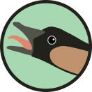
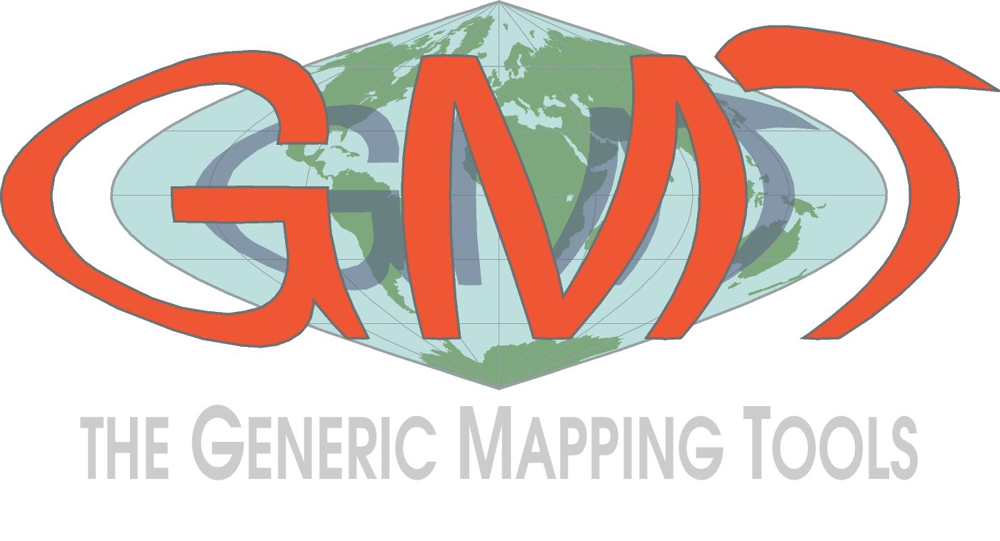
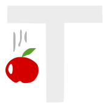



## Nēnē: A no-frills static site generator

Nēnē is the side project that I use to blow off steam and experiment with
Python without the pressures of backwards compatibility and testing that my
research software work requires.
It's also what I use to build this website.

The name is a nod to [Urubu](https://github.com/jandecaluwe/urubu), which I
used to build my website before, and the
[unforgettable time I spent in Hawai'i](/blog/hawaii-gmt-postdoc.html).

{{ macros.button_link("https://github.com/leouieda/nene", "GitHub", type="btn-primary", icon="fab fa-github", size="") }}
{{ macros.button_link("https://nene.leouieda.com/", "Website", type="btn-light", icon="fa fa-external-link-square-alt", size="") }}

  

## Fatiando a Terra

Fatiando provides Python libraries for data processing, modeling, and inversion
across the Geosciences.
It is built by a community of geoscientists and software developers with a
passion for well-designed tools and helping our peers.

I've been working on Fatiando since around 2010 when I started my MSc.
It's been the main focus of my career and it permeates all aspects of my work,
from research to teaching.

{{ macros.button_link("https://github.com/fatiando", "GitHub", type="btn-primary", icon="fab fa-github", size="") }}
{{ macros.button_link("https://www.fatiando.org", "Website", type="btn-light", icon="fa fa-external-link-square-alt", size="") }}

  

## Generic Mapping Tools (GMT)

GMT is one of the most widely used open-source software projects in the Earth
Sciences. It's been around for decades and is to many the very symbol of
open-source. I had the pleasure to
[join the GMT team](/blog/hawaii-gmt-postdoc.html) during my postdoc working
on [PyGMT](https://www.pygmt.org).

Recently, my contributions to GMT and PyGMT have been more on the community and
guidance side than actual coding.
Thankfully, they don't really need me for the coding parts.

{{ macros.button_link("https://github.com/GenericMappingTools", "GitHub", type="btn-primary", icon="fab fa-github", size="") }}
{{ macros.button_link("https://www.generic-mapping-tools.org/", "Website", type="btn-light", icon="fa fa-external-link-square-alt", size="") }}

  

## Tesseroids

A collection of command-line programs for modelling the gravitational attraction
of spherical prisms (tesseroids).

This was my first open-source project. I started working on Tesseroids as part
of my BSc dissertation project with
[Naomi Ussami](http://lattes.cnpq.br/6704246490515612) and
[Carla Braitenberg](https://www2.units.it/braitenberg/).
Through Tesseroids, I learned about documentation, unit tests,
cross-compilation, version control, and more.

{{ macros.button_link("https://github.com/leouieda/tesseroids", "GitHub", type="btn-primary", icon="fab fa-github", size="") }}
{{ macros.button_link("https://tesseroids.leouieda.com/", "Website", type="btn-light", icon="fa fa-external-link-square-alt", size="") }}

  

